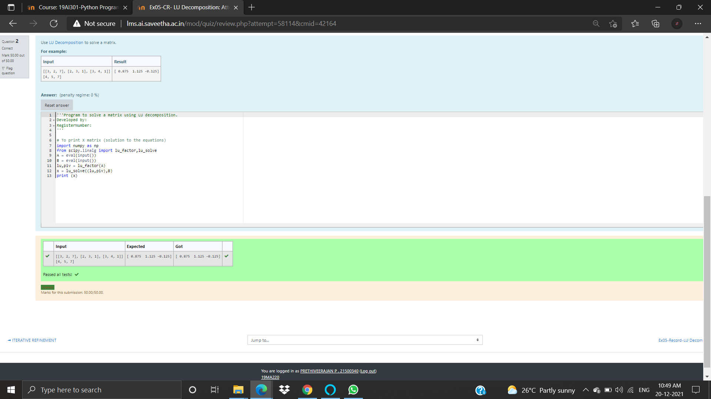
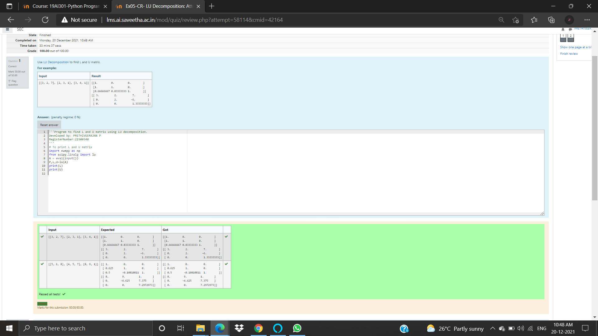

# LU Decomposition without zero on the diagonal

## AIM:
To write a program to find the LU Decomposition of a matrix.

## Equipments Required:
1. Hardware – PCs
2. Anaconda – Python 3.7 Installation / Moodle-Code Runner

## Algorithm
1. import numpy 
2. import scipy 
3. priny(l)
4. print(u)

## Program: to find L AND U
```
Program to find L and U matrix using LU decomposition.
Developed by: 
RegisterNumber: 

# To print L and U matrix
import numpy as np 
from scipy.linalg import lu
A = eval(input())
P,L,U=lu(A)
print(L)
print(U)
```
## Output: for L AND U


## Program: to find lu decompostion
```
Program to solve a matrix using LU decomposition.
Developed by: prethiveerjan P
RegisterNumber: 21500340
'''
#To print X matrix (solution to the equations)
import numpy as np
from scipy.linalg import lu_factor,lu_solve
A = eval(input())
B = eval(input())
lu,piv = lu_factor(A)
x = lu_solve((lu,piv),B)
print (x)
```
## Output: LU DECOMPOSTION



## Result:
Thus the program to find the LU Decomposition of a matrix is written and verified using python programming.

